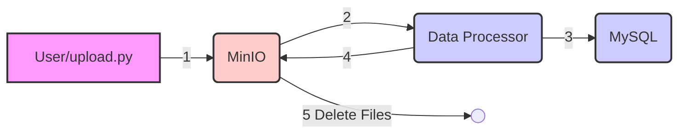

# Example
This example demonstrates a simple ETL pipeline using MinIO (S3 alternative, just for demo purposes), a Python data processing application, and MySQL.

## Data Flow



The data flow is as follows:

- (1) User uploads data to MinIO
- (2) Data Processor processes the data
- (3) Data Processor writes to MySQL
- (4) Data Processor sends delete commands to MinIO
- (5) MinIO deleted files

## Code Structure

```
ETL-example/
│
├── data_processor/
│   ├── app.py: The main application file for data processing.
│   ├── Dockerfile: Docker configuration for the data processor.
│   └── requirements.txt: Lists the Python dependencies for the data processor.
│
├── ops_script/
│   ├── upload.py: Script to upload data to MinIO.
│   ├── mysql_validation.py: Script to validate data in the MySQL database.
│   └── trigger_api.py: Script to trigger the API.
│
├── mysql/
│   └── init.sql: SQL script to initialize the MySQL database.
│
├── test_data/
│   └── sales_data.csv: Example sales data for testing.
│
├── docker-compose.yml: Docker Compose file to orchestrate the services.
│
└── README.md: Project README file.
```

## How to Use

1. Set up the environment: Ensure Docker and Docker Compose are installed.
2. Configure the services: Modify the `docker-compose.yml` file and update environment variables as needed.
3. Run the application:

   ```bash
   docker-compose up --build
   ```
4. Upload data: You can upload data to MinIO using the `upload.py` script, or by connecting to the web UI at http://localhost:9001 using the credentials `minioadmin` for both the account and password.
5. Validate data: Use the `mysql_validation.py` script to print the data in MySQL.


## Example

### Running the application

To start the application:

```bash
docker-compose up --build
```

This command will build and start the services. You should see output indicating the services are running.

### Uploading data

To upload data:

```bash
python ops_script/upload.py
```

Example output:

```text
test_data\sales_data.csv uploaded to MinIO bucket 'sales-data' as 'sales_data.csv'
Upload successful
```

### Triggering the API

To trigger the API:

```bash
python ops_script/trigger_api.py
```

Example output:

```text
API triggered
```

### Validating data

To validate data in MySQL:

```bash
python ops_script/mysql_validation.py
```

Example output:

```text
(1 101 1 datetime.date(2025 3 1) 10 2 20)
(2 102 2 datetime.date(2025 3 1) 5 6 30)
(3 103 3 datetime.date(2025 3 1) 12 1 12)
(4 104 4 datetime.date(2025 3 1) 8 3 24)
(5 105 5 datetime.date(2025 3 1) 15 1 15)
(6 106 6 datetime.date(2025 3 1) 7 5 35)
(7 107 7 datetime.date(2025 3 1) 9 2 18)
(8 108 8 datetime.date(2025 3 1) 11 2 22)
(9 109 9 datetime.date(2025 3 1) 6 5 30)
(10 110 10 datetime.date(2025 3 1) 14 1 14)
```
