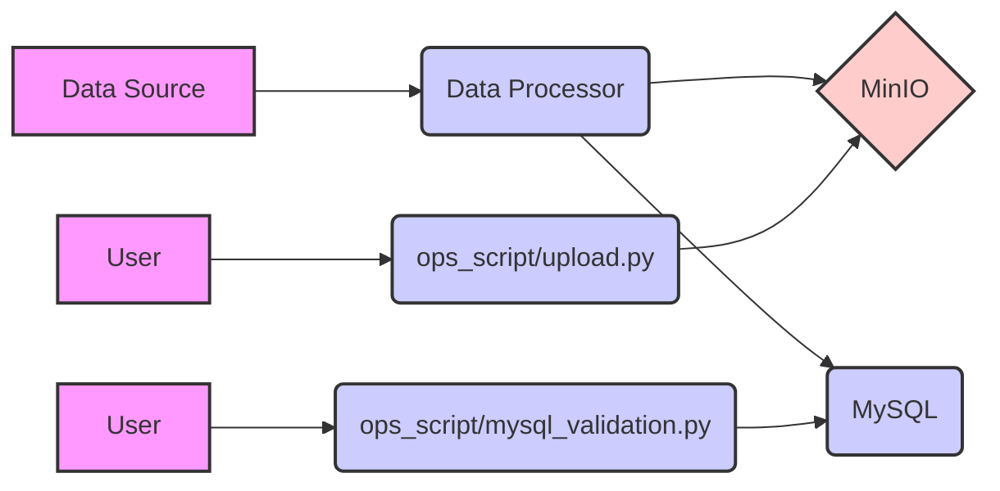

# Project Explanation

## Structure

This project consists of several components:

- `data_processor/`: Contains the data processing application.
  - `app.py`: The main application file.
  - `Dockerfile`: Docker configuration for the data processor.
  - `requirements.txt`: Lists the Python dependencies.
- `ops_script/`: Contains operational scripts.
  - `upload.py`: Script to upload data.
  - `mysql_validation.py`: Script to validate MySQL data.
- `minio/`: Contains MinIO configuration, used for storing Docker's storage.
- `mysql/`: Contains MySQL configuration.
  - `init.sql`: SQL script to initialize the database.
- `test_data/`: Contains test data.
  - `sales_data.csv`: Example sales data.
- `docker-compose.yml`: Docker Compose file to orchestrate the services.
- `README.md`: Project README file.

## Architecture



## Usage

1.  **Set up the environment:**

    - Ensure Docker and Docker Compose are installed.
2.  **Configure the services:**

    - Modify the `docker-compose.yml` file to adjust service configurations as needed.
    - Update the environment variables in the `docker-compose.yml` file.
3.  **Run the application:**

    ```bash
    docker-compose up --build
    ```
4.  **Upload data:**

    - Use the `upload.py` script to upload data to MinIO.
5.  **Validate data:**

    - Use the `mysql_validation.py` script to validate the data in MySQL.

## Example

### Running the application

To start the application, navigate to the project root directory and run:

```bash
docker-compose up --build
```

This command builds and starts the services defined in the `docker-compose.yml` file.

### Uploading data

To upload data, use the `upload.py` script:

```bash
python ops_script/upload.py <file_path>
```

Replace `<file_path>` with the path to the data file you want to upload.

### Validating data

To validate the data in MySQL, use the `mysql_validation.py` script:

```bash
python ops_script/mysql_validation.py
```

This script connects to the MySQL database and performs validation checks.
